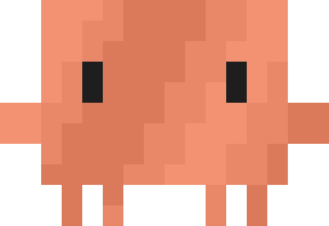
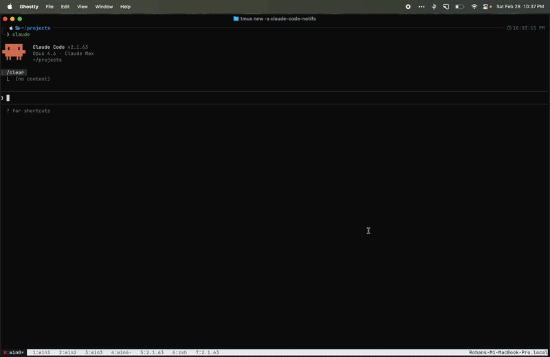

<div align="center">


<h1>Claude Code Notifier</h1>

Native macOS notifications for <a href="https://docs.anthropic.com/en/docs/claude-code" target="_blank">Claude Code</a>.
Know when Claude finishes or needs your input.

<a href="https://www.apple.com/macos/" target="_blank"></a>
<a href="notify.sh"></a>
<a href="LICENSE"></a>

<br>



</div>

## Features

- **Two notification types** — "Done" when Claude finishes, "Needs Input" when Claude needs approval
- **Teleport** — Click a notification to teleport back to the right terminal, tmux session, window, and pane — no matter where you are on your computer (requires `terminal-notifier`)
- **tmux context** — Shows session name, window number, and window name
- **Project name** — Displays the current project directory
- **Suppression** — Skips notifications when you're already viewing the Claude Code session
- **Custom icon** — Use your own app icon instead of the default Script Editor icon
- **Sound** — Plays a sound per notification type

```
Claude Code — Done
myproject w3 > feature-branch · my-app
Claude has finished and is awaiting further instructions
```

## Quick Start

```bash
brew install jq                    # required
brew install terminal-notifier     # recommended — enables teleport and custom icon

git clone https://github.com/YOUR_USERNAME/claude-code-notifier.git
cd claude-code-notifier
./install.sh
```

The install script:
1. Symlinks `notify.sh` into `~/.claude/hooks/`
2. If `icon.png` exists in the repo, builds a `ClaudeNotifier.app` with your icon
3. Prints the hooks config to add to your `settings.json`

### Custom icon

Place a **1024x1024 PNG** named `icon.png` in the repo root before running `install.sh`. This gets baked into a minimal `.app` bundle that macOS uses as the notification icon.

Without `icon.png`, notifications fall back to `osascript` (Script Editor icon) or `terminal-notifier` (Terminal icon).

## How it works

Claude Code's <a href="https://docs.anthropic.com/en/docs/claude-code/hooks" target="_blank">hooks system</a> runs shell commands on lifecycle events:

| Hook | Event | Notification |
|------|-------|-------------|
| `Stop` | Claude finishes responding | "Claude Code — Done" |
| `Notification` | Claude needs approval (permission prompt) | "Claude Code — Needs Input" |

The script reads JSON from stdin (provided by Claude Code), extracts the working directory, and queries tmux for session/window context. If you're already looking at the session in a supported terminal (Ghostty, iTerm2, Alacritty, kitty, WezTerm, Terminal), the notification is suppressed.

### Notification priority

The script tries these in order:

1. **`ClaudeNotifier.app`** — custom icon + teleport, requires `terminal-notifier` + `icon.png` setup
2. **`terminal-notifier`** — teleport, no setup beyond `brew install`
3. **`osascript`** — zero dependencies, but no teleport support

### Teleport

When `terminal-notifier` is installed, clicking a notification brings you back to where Claude Code is running. It activates your terminal, switches to the correct tmux session, selects the right window, and focuses the exact pane.

Supported terminals: Terminal.app, iTerm2, Ghostty, Alacritty, kitty, WezTerm.

<details>
<summary><strong>Manual setup</strong></summary>

If you prefer not to use `install.sh`:

**1. Symlink the script:**

```bash
mkdir -p ~/.claude/hooks
ln -sf /path/to/claude-code-notifier/notify.sh ~/.claude/hooks/notify.sh
```

**2. Add hooks to `~/.claude/settings.json`:**

```json
{
  "hooks": {
    "Notification": [
      {
        "matcher": "permission_prompt",
        "hooks": [
          {
            "type": "command",
            "command": "~/.claude/hooks/notify.sh needs_input"
          }
        ]
      }
    ],
    "Stop": [
      {
        "matcher": "",
        "hooks": [
          {
            "type": "command",
            "command": "~/.claude/hooks/notify.sh done"
          }
        ]
      }
    ]
  }
}
```

**3. Activate the hooks.**

Open the `/hooks` menu in Claude Code to review and accept the new hooks, or restart your session.

</details>

<details>
<summary><strong>Troubleshooting</strong></summary>

**Notifications don't appear when screen recording or mirroring:**
macOS suppresses banners during screen sharing as a privacy feature. Fix: System Settings > Notifications > "Allow notifications when mirroring or sharing the display" > Allow Notifications.

**Notifications show in Notification Center but not as banners:**
Check System Settings > Notifications > find "ClaudeNotifier" (or "terminal-notifier") > set alert style to "Banners" or "Alerts".

**tmux info not showing:**
Make sure Claude Code is running inside a tmux session. The `$TMUX` and `$TMUX_PANE` environment variables must be set.

**Square brackets in subtitle cause it to disappear:**
Known `terminal-notifier` bug. The script avoids brackets by default.

</details>

## License

MIT
